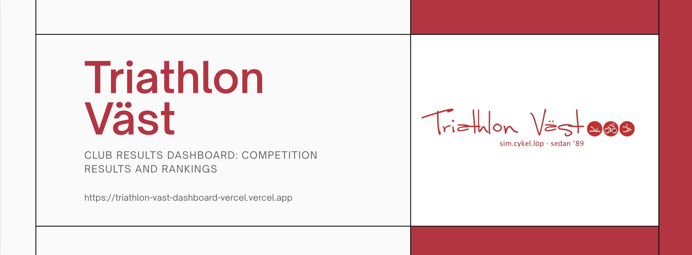
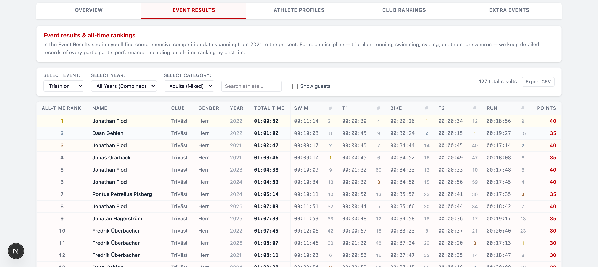
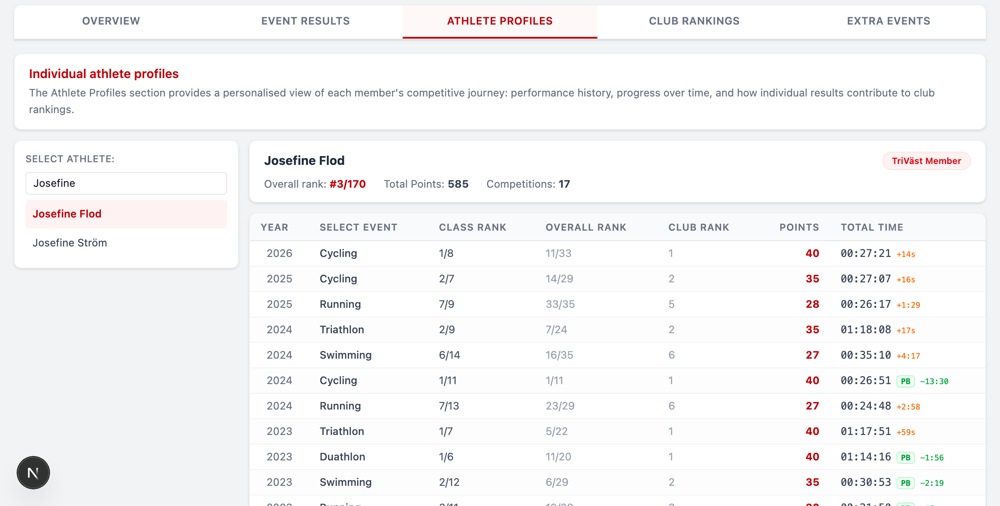
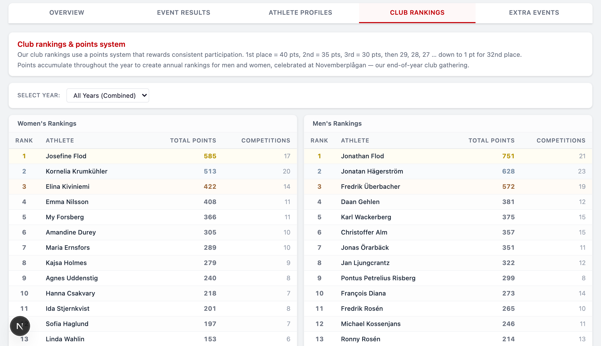
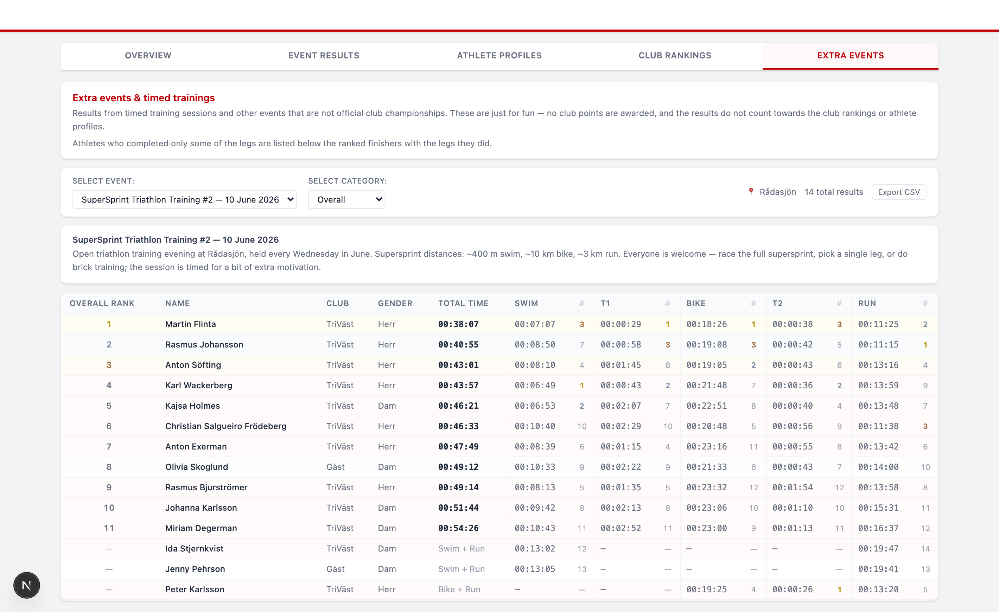

<p align="center">
  
</p>

<p align="center">
  
  
  
  
  
</p>

> Club results dashboard for Triathlon Väst — explore competition history, athlete rankings, and participation trends across 6 sports from 2021 to 2026.

## Overview

An internal analytics dashboard for Triathlon Väst members. It aggregates CSV result files from club competitions (triathlon, duathlon, swimming, cycling, running, swimrun) spanning 2021–2026 and makes them searchable and visual. Athletes can look up their personal results, track rankings over time, and compare against the full field.

The dataset currently covers **27 competitions** across 6 sports (triathlon, duathlon, swimming, cycling, running, swimrun) from **2021–2026**, including 1 swimrun event added in 2025.

Beyond the championships, the dashboard also tracks **extra events** — timed open training sessions like the Rådasjön SuperSprint series — kept separate from the official results: no club points, no effect on rankings or athlete profiles.

## Screenshots

### Event Results

Browse all competition results filtered by sport, year, and category. Each entry shows overall and class rankings, total time, individual segment splits, and the club points earned in that event. Results can be exported as CSV.

<p align="center">
  
</p>

### Athlete Profiles

Individual athlete pages showing competition history, accumulated points, overall club rank, and performance trends across seasons and disciplines.

<p align="center">
  
</p>

### Club Rankings

Annual leaderboards for men and women, based on a points system that rewards consistent participation — 1st place earns 40 pts, 2nd 35 pts, 3rd 30 pts, then 29, 28, … down to 1 pt for 32nd. Points are awarded by rank among club members within each gender class. Youth (Ungdom) and children (Barn) race shorter courses and don't earn club points; DNF results earn no points; athletes with identical times share the rank and its points.

<p align="center">
  
</p>

### Extra Events

Timed training sessions and other non-championship events — like the Rådasjön SuperSprint series — each with its own description, split rankings, and Overall/Men/Women category filter. Athletes who completed only some legs are listed unranked with the legs they did. No club points are awarded.

<p align="center">
  
</p>

## Highlights

### Features

- **Overview tab**: Season-level participation trends, summary of all championships, and quick links into each discipline's results
- **Results tab**: Filter and browse all competition results by sport, year, and category — per-event club points column and CSV export included
- **Athletes tab**: Individual athlete profiles with full result history, personal bests, year-over-year deltas, and per-event points
- **Rankings tab**: Club-wide leaderboards (women / men, per year or all-time) based on aggregated points across events
- **Extra Events tab**: Timed trainings and other non-KM events with split ranks, category filter, bilingual event descriptions, and CSV export — partial participants listed unranked
- **Bilingual UI**: Swedish / English toggle throughout
- **Keyboard-accessible tabs**: proper tablist semantics with arrow-key navigation

## Tech Stack

| Tool | Version |
|------|---------|
| Next.js | 16.2 |
| React | 19.2 |
| Recharts | 3.8 |
| Tailwind CSS | 4.x |
| Playwright | 1.58 |

CSV parsing is handled by a small built-in parser in `src/lib/loader.ts` — the data files are author-controlled, so no CSV library is needed.

## Getting Started

### Prerequisites

- Node.js 20+

### Installation

```bash
git clone https://github.com/Thiebauts/triathlon-vast-dashboard.git
cd triathlon-vast-dashboard
npm install
```

### Quick Start

```bash
npm run dev
# Open http://localhost:3000
```

### Tests

```bash
npm test          # unit tests (node:test, no build needed)
npm run test:e2e  # Playwright e2e — needs the app running on :3000 first

# Python data-pipeline tests
cd nytatime && python3 -m unittest test_extra_events
```

## Project Structure

```
triathlon-vast-dashboard/
├── README.md
├── package.json
├── next.config.ts
├── tsconfig.json
├── data/                        # CSV result files (inputs, not edited manually)
│   ├── processed_<sport>_results_<date>.csv
│   └── extra/                   # non-KM events: result CSVs + events.json manifest
├── nytatime/                    # Python pipeline: NyTaTime API → data/ CSVs
│   ├── fetch.py                 # one-command KM fetch (year + sport)
│   ├── fetch_extra.py           # one-command extra-event fetch (year + keyword)
│   ├── retrieve_event_results.py
│   ├── retrieve_extra_event_results.py
│   ├── nytatime_api.py
│   └── test_extra_events.py     # pipeline unit tests
├── public/                      # Static assets (logo, favicon, screenshots)
├── scripts/
│   └── capture-screenshots.mjs  # Regenerates the README screenshots
├── tests/
│   └── e2e.mjs                  # Playwright end-to-end suite
└── src/
    ├── app/                     # Next.js App Router
    │   ├── layout.tsx
    │   ├── page.tsx
    │   ├── globals.css
    │   ├── robots.ts
    │   ├── sitemap.ts
    │   └── favicon.ico
    ├── components/
    │   ├── Dashboard.tsx        # Main shell with tab navigation
    │   ├── Header.tsx
    │   ├── LanguageProvider.tsx
    │   ├── charts/
    │   │   ├── AthleteCharts.tsx
    │   │   └── ParticipationChart.tsx
    │   └── tabs/
    │       ├── OverviewTab.tsx
    │       ├── ResultsTab.tsx
    │       ├── AthletesTab.tsx
    │       ├── RankingsTab.tsx
    │       └── ExtraEventsTab.tsx
    └── lib/
        ├── loader.ts            # Server-side CSV loading (built-in parser)
        ├── data.ts              # Query helpers: rankings, points, splits
        ├── csv.ts               # CSV export escaping (formula-injection guard)
        ├── types.ts             # Shared TypeScript types
        ├── translations.ts      # EN/SV string catalogue
        └── __tests__/           # Unit tests (node:test)
```

## Data Entry Rules (NyTaTime)

When exporting results from NyTaTime, follow these rules to keep the data consistent:

**Names**
- Always use **full first name and surname** — no nicknames (e.g., "Tobias Olsson", not "Tobbe")
- Use **proper capitalization** for both first and last name (e.g., "Daniel Sastre", not "Daniel sastre")
- Keep surname particles lowercase: "van", "du", "de" (e.g., "Stijn van Weegberg")
- Use the **same spelling** consistently across seasons — check previous files if unsure

**Class (gender / age group)**
- Adults: `Herr` or `Dam`
- Youth: `Ungdom` (teens) or `Barn` (children) — shorter courses, excluded from club points
- Do not use: ~~Herrar~~, ~~Damer~~, ~~Man~~, ~~Male~~, ~~Female~~, ~~Ungdomar~~, ~~SuperSprint~~

**Club**
- Only two values allowed: `TriVäst` or `Gäst`
- Do not use: ~~Triväst~~, ~~Triathlon Väst~~, ~~Ej medlem~~, ~~-~~

**Times**
- If a split time was not captured, leave the field **empty** — do not enter `0` or a negative value

**Rankings**
- `Overall_Rank` must be sequential starting from 1
- `Class_Rank` must be sequential within each class (Herr and Dam ranked separately)

**Status**
- Only two values: `ok` or `dnf`
- `dnf` rows appear in the results (listed last, unranked) but earn no club points

**General**
- No trailing whitespace in any field
- File encoding: **UTF-8**
- One empty line at end of file maximum

## Extra Events Workflow (non-KM)

Timed trainings and other non-championship events live in `data/extra/` and appear under the dashboard's Extra Events tab. They earn no club points and stay out of the rankings and athlete profiles.

To add one:

1. `cd nytatime && python3 fetch_extra.py 2026 "supersprint training #3"`
2. Review the script's `Partial:` warnings — a missed chip read would wrongly demote a finisher to partial
3. Polish the EN/SV `title`, `location`, and `description` in `data/extra/events.json`
4. Commit `data/extra/` and push — the next deploy picks it up

Participants who skipped legs are stored with `Status: partial` (only the legs they completed, no total time, no rank); participants with no recorded times at all are excluded.

## Contributing

Have ideas for new features, spotted a bug, or want to fix something yourself?

- **Email**: Send feedback or suggestions to [schirmer.thiebaut@gmail.com](mailto:schirmer.thiebaut@gmail.com) with the subject prefix `[triathlon-vast-dashboard]`
- **GitHub**: If you're familiar with code, open an [issue](https://github.com/Thiebauts/triathlon-vast-dashboard/issues) or submit a [pull request](https://github.com/Thiebauts/triathlon-vast-dashboard/pulls) — all contributions are welcome and will be reviewed

## Deployment

Deployed on Vercel. Push to `main` triggers an automatic production deploy. CSV data files are bundled at build time — update `data/` and redeploy to refresh results.

## License

© Triathlon Väst. All rights reserved. Private internal tool — not for redistribution.
